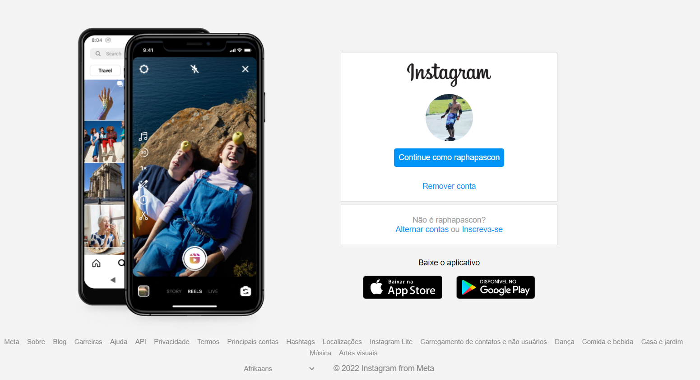

  

Interface Login Instagram

 

## Mente por trás do projeto / Tutora

Gabriela Spruce

 

## O Projeto
Bootcamp DIO Santander Fullstack - Criando uma interface do login do Instagram.

 

## Desafio
Recrie a interface do login do Instagram utilizando CSS3 com Flexbox.

 

## O que foi utilizado:
  * HTML 5
  * CSS 3
  * JAVA SCRIPT

 

## Funcionalidades

- Layout Padrão
- CSS com Flexbox
- Responsivo

 

## Screenshots

